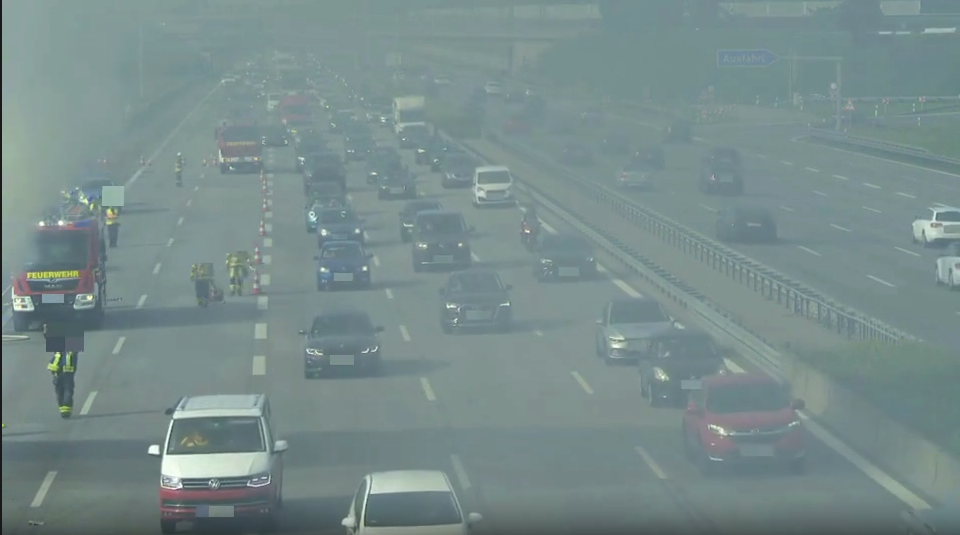
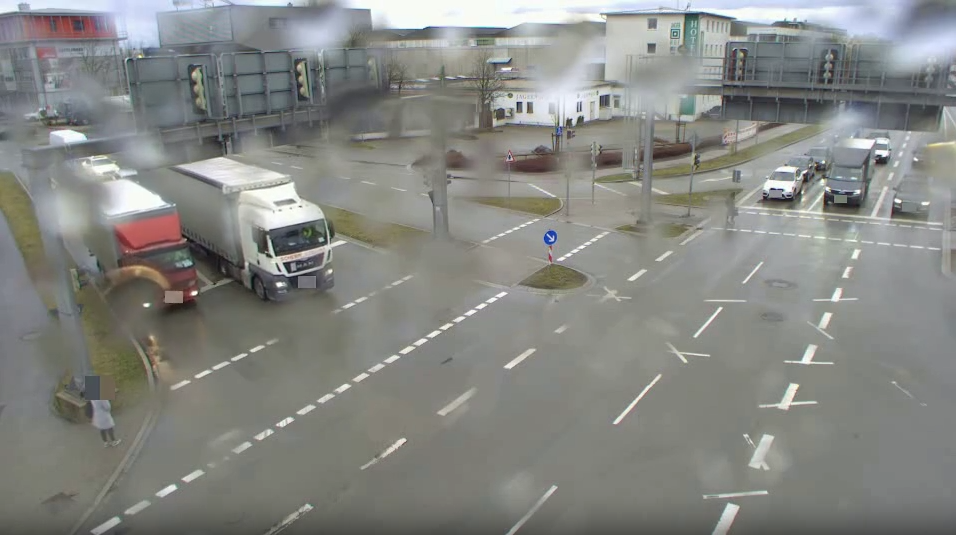

# 🚦 Traffic Dataset Anonymization (Tumtraffic-VideoQA) 


[](https://creativecommons.org/licenses/by-nc-sa/4.0/)


This project provides a workflow for traffic dataset anonymization with **YOLOv11 model** for single-class **license plate/face detection**. 

<p align="center">
  
  
</p>


## Model Checkpoints 📦
  To obtain the pretrained checkpoints required for license plate and face detection, please register and request access at [TUMTraffic Dataset Series](https://a9-dataset.innovation-mobility.com/register).  
  
## Environment Setup 🧰

- **Python** ≥ 3.9
- **Recommended**: Conda virtual environment

1. Install virtual environment:
   ```bash
   conda create -n trafficano python=3.9
   conda activate trafficano
   ```

2. Clone the repository and install project dependencies:
   ```bash
   git clone https://github.com/TraffiX-VideoQA/traffic-plate-face-anonymization.git
   cd traffic-plate-face-anonymization
   pip install .
   ```

3. Quick Start 🚀:
   
   **Notice**: Before running the scripts, please check and modify the paths in the scripts according to your actual data structure. Some scripts have hardcoded paths that may need adjustment.

   - For license plate mosaic redaction 🪪:
     ```bash
     python TrafficAnonymization/video_mosaic_plate_fullversion.py \
       --videos_dir tumtraffic_split/split_x \
       --out_dir outputs_redacted_framewise/split_x \
       --mode baseline \
       --device 0 --imgsz 1280 --conf 0.25 --iou 0.6
     ```
   - For face mosaic redaction 🙂:
     ```bash
     python TrafficAnonymization/face_mosaic_yolofacePandF.py \
       --videos_dir face_included_videos \
       --out_dir face_mosaic_videos_yoloPandF \
       --person_model yolo11s.pt \
       --face_model runs/face_detect/weights/best.pt \
       --hybrid \
       --nms_union_iou 0.5 \
       --imgsz 1280 \
       --person_conf 0.30 --person_iou 0.6 --person_expand 0.22 --min_person_px 16 \
       --face_conf 0.22 --face_iou 0.6 --face_expand 0.50 \
       --upscale 1.6 \
       --mosaic_block 13
     ```

---


## Acknowledgement 🙏
- Thanks to [Ultralytics](https://github.com/ultralytics/ultralytics)
